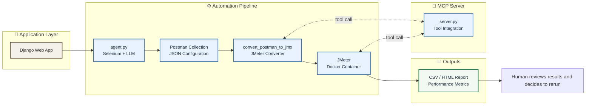

# 🚀 JSON to JMX - Automated API Performance Optimization System

> An intelligent, end-to-end automated workflow for discovering APIs, testing their performance, and optimizing them with human-in-the-loop feedback.


## 📋 Table of Contents

- [🎯 Overview](#-overview)
- [✨ Features](#-features)
- [📂 Repository Structure](#-repository-structure)
- [📊 Workflow Diagram](#-workflow-diagram)
- [🚀 How the System Works](#-how-the-system-works)
- [💻 Usage Guide](#-usage-guide)
- [📊 Understanding Output Files](#understanding-output-files)
- [🤝 Contributing](#-contributing)


## 🎯 Overview

This repository demonstrates a complete pipeline for API discovery and performance testing:

1. Crawling a running web application using a headless browser and suggestions from an LLM to explore pages and forms.
2. Recording all HTTP requests made by the application and writing them to a **Postman collection JSON**.
3. Converting that collection to a **JMeter `.jmx` test plan** with a Python converter.
4. Running the JMeter plan inside a Docker container to produce performance results (CSV/HTML).
5. Providing a simple FastMCP server exposing the conversion and execution steps as callable tools, enabling integration with AI agents or desktop clients like Claude Desktop.
6. Allowing a human-in-the-loop to review results and rerun the pipeline until the APIs meet performance expectations.

The system is intentionally minimal so that even beginners can follow the flow. It can be extended for more complex applications and richer test scenarios.


---
## ✨ Features

| Feature | Description |
|---------|-------------|
| 🔍 **Auto-Extract APIs** | Crawls target URL and discovers all API endpoints |
| 📦 **Postman Collection Generation** | Auto-generates Postman-compatible JSON collections |
| 🔄 **Smart Conversion** | Converts Postman → JMX with `convert_postman_to_jmx.py` |
| 🐳 **Docker-Integrated JMeter** | Runs JMeter in Docker (no manual setup required) |
| 📈 **Rich Reports** | Generates HTML + CSV performance dashboards |
| 🔄 **Human-in-Loop Optimization** | Interactive workflow for performance tuning |
| 🤖 **MCP Server Integration** | Exposes tools for Claude Desktop & AI agents `postman_to_jmx` and `run_jmeter` |
| 📊 **Real-Time Monitoring** | Track test progress with live dashboards |
| 🎯 **Rerun Capability** | Easy test reruns with different configurations |


---
## 📁 Repository Structure

```
.
├── agent.py                        # Selenium crawler that builds a Postman collection
├── convert_postman_to_jmx.py       # Library + CLI that transforms a Postman JSON to a JMeter JMX
├── server.py                       # FastMCP server exposing `postman_to_jmx` and `run_jmeter` tools
├── demo_app/                       # Sample Django application with user dashboard and CRUD APIs
├── data/                           # Example files and runtime output (collections, JMX, results)
│   ├── sample.postman_collection.json
│   ├── sample.jmx
│   ├── results.csv
│   └── output/                     # default write location for new collections/jmx
├── mcp.json                        # MCP configuration used by the server
└── README.md                       # You are here
```
---


## 📊 Workflow Diagram




## 🚀 How the System Works

1. **Extract APIs from the URL:** The crawler (`agent.py`) uses Selenium to navigate the front end. It asks an LLM (OpenAI GPT) for a concise next action like clicking links or filling forms and records the resulting network requests.
2. **Generate Postman collection:** All observed requests are appended to a collection object and written to a JSON file.
3. **Convert to JMX:** The `PostmanToJMeterConverter` class reads the JSON and builds an equivalent JMeter test plan, preserving headers, parameters, bodies, and basic assertions.
4. **Run JMeter:** Using the Docker image `justb4/jmeter`, the plan is executed (`run_jmeter` tool). Results are captured in CSV and can be transformed into HTML by JMeter itself.
5. **Human-in-loop approval:** A tester inspects the performance report. If service-level objectives are not met, they can adjust the prototype or try again with different agent settings.

---

## 💻 Usage Guide

### Prerequisites
1. Python 3.10+
2. `pip install selenium webdriver-manager openai mcp`
3. Docker installed and running
4. (Optional) Set `OPENAI_API_KEY` environment variable to use the LLM suggestion feature in the agent.

### Run the Django demo app
```bash
cd demo_app
python manage.py migrate
python manage.py runserver
```

### Run the crawler agent
```bash
python ../agent.py http://127.0.0.1:8000
```

Options:
- `-o/--output` – specify the output path for the Postman collection (default `data/output/collection.json`).
- `-m/--max-pages` – maximum number of pages to visit (default 10).

### Convert the collection to JMX

**Locally**:
```bash
python convert_postman_to_jmx.py data/output/collection.json -o data/output/testplan.jmx
```

**Via MCP server** (start the server first):
```bash
python server.py
# Then use an MCP client or Claude Desktop to call the tool:
# tool name postman_to_jmx collection="$(<data/output/collection.json)" output="data/output/testplan.jmx"
```

Directories are created automatically if they do not exist.

### Run JMeter via MCP

```bash
# using an MCP client:
# tool name run_jmeter jmx_path="data/output/testplan.jmx" results_path="data/results.csv"
```

The default results path is `data/results.csv` and the folder will be created if necessary.

### Review and iterate

Open `data/results.csv` (or convert to HTML with JMeter) to view response times, error rates, etc. Adjust agent parameters or application logic and repeat as needed.

---
## Understanding Output Files
| File  | Purpose|
|-------|--------|
|`output.jmx`|Jmeter Test Plan|
|`results.csv`|Raw performance results|
|`index.html`|Interactive performance dashboard|

## 🤝 Contributing

This project is a learning/demo tool. Suggestions, bug reports and pull requests are very welcome.

To contribute:
1. Fork the repository.
2. Create a feature branch (`git checkout -b feature/awesome`) and add tests if possible.
3. Submit a pull request with a clear description of your changes.

---

# Happy Testing!
